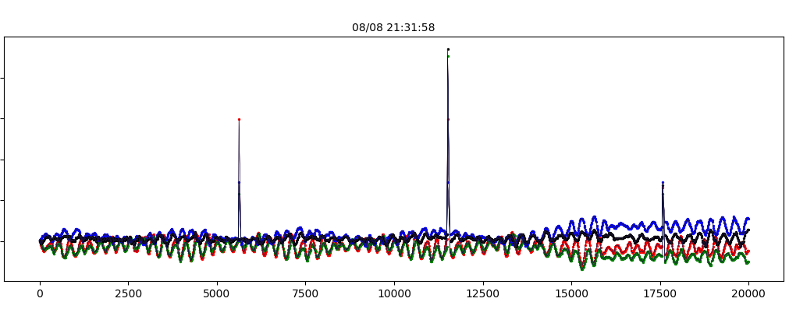

# Supervised Convolutional Neural Network Regression model

Strain weight sensors used for collecting the vibration data and obtaining heart rate of a human.

This repo is the result of curiosity/research pet project involving RaspberryPi, regular floor scale weight sensors and some ML. The sensors were placed under the legs of a bed. Analog-to-digital-converters were used to collect weight pushing on each of the four sensors. The accumulated data was stored and analysed and regression model was built that is capable of extracting heart rate of a person.

## Hardware for collecting the data

ADC connected to a sensor under a leg of the bed

Even though the sensors are not very precise and the noise of the signal is in about 7 grams range, the sensors are noticeably sensitive. Example of smoothed data with a person laying in the bed as still as possible, holding breathing at the end. The raw data was smoothed with both a median filter and applying sliding window average.

Same data before smoothing. The 3 spikes are caused by the ADC (converters) failing sometimes.

Labels were obtained using heart rate monitor of Samsung Gear S3 watch. The accuracy of the monitor is [reported](https://www.hrsonline.org/new-study-show-popular-smart-watches-accurately-measure-rapid-heart-beat) to be about 5 bpm for lower heart rates and 10 bpm for heart rates above 108 bpm.

Computer for collecting and storing the data - RaspberryPi v.3

4 Sensors - full bridge Load Cell 75 kg.

Analog to digital converter (ADC): HX711, 80 samples per second mode. Actual rate is about 87 samples per second.

## Data cleaning/filtering/augmenting.

8 months, 1 measurement every 10 minutes of labeled data was available. The raw data from the sensors was converted to grams using simple linear interpolation based on two points. The subset of the data was selected to include 2050 samples around each label timestamp, which is roughly 20 seconds interval, starting 10 seconds before a label and finishing 10 seconds after.

Then each 2050 samples batch was split using sliding window into chunks with the length 1025 samples. Then each 50-est (1 chunk out of each 50) was selected. This multiplied the number of available samples.

The ADC (converters) sometimes fail and produce spikes way outside of the regular range. Experiments show that smoothing the data for filtering, and smoothing the data for training better be done differently. First the data was smoothed using median filter only to decide what samples to keep. Then the data passed through the filter was smoothed for training in another way.

### filtering

Chunks were filtered so that only one specific person was in the bed during the measurement. It was done by knowing the weight of the person. 

Then chunks with more than 200 g. variance were discarded. This limited the training data to the periods when the person was relatively still.

Because some of the labels contained unusually high heart rates, the data was further filtered to exclude labels > 140 bpm as unrealistic.

### smoothing

Before feeding the data into the network each chunk was converted to differences between consecutive measurements, making 1024 samples features out of each 1025 chunk. Given that the data here is not smoothed, the values (deltas) were passed through hard limit filter: maximum(minimum(x, 1000), -1000). Then the data was normalized by scaling and shifting using hardcoded parameters defined by experiments. These transforms removed the DC component of the signal and at the same time reduced the variance of the input.

First 7 months of available data (September, October, November, December, January, February, April) were used as the training set. And June data was used for validation.

## Neral Network Architecture

Regression model that was used is a 1D Convolutional Neural Network with tanh() at the output followed by a linear node.

Note: By convention the dimensionality of convnets is one less than the dimension of the data because one of the dimensions is called channels. For example, an image would have two spatial dimensions and RGB color values making it H x W x 3 3d data but the convolution would be called a conv2d. And 1D in the case of this model is 1 dimension with 4 channels data at the input.

Four convolutional layers were interlaced with pooling so that after each conv+pooling the output becomes a power of two fraction in size. The length of each layer's output was decreasing as follows: 1024 input -> 256 -> 64 -> 32 -> 16. Non conventional pooling was implemented. Instead of max-pool or average-pool, it was a convolutional layer with large stride. For example first pooling (second layer) had kernel size 8 and stride 4, effectively reducing the output to 1/4-th of the input.

Having the length of the last pooling output to be 16, the next fully connected layer converted it to a single (16 channels) value. Fully connected layer was also implemented using a convolution with kernel of 16 and stride 16. There was no technical reason to implement fully connected layer like that. It just made experimentation easier with homogeneous layers and varying parameters (kernel size, stride, output channels number).

Batch normalization layers in the middle didn't show any improvements but introduced training instability. So the batch normalization was not used.

Finally the last layer was purely linear. scaling and shifting the output so that it falls into the required range 45 - 110 bpm.

Recurrent network architecture was considered, but because it didn't perform well in other projects with this kind of data it was out of scope.

## Results

Validation RMSE vs training steps

The training was stopped as soon as the validation error (RMSE) dropped below 4. Otherwise, based on the observation, the network would start overfitting and the validation error would increase.

### Validation set results after 14 minutes of training
- mae: 3.0060422
- rmse: 3.9059427 (Square root of mean squared error)
- loss: 14.922859, 
- global_step: 2912

Error distribution on the training set is within 10 bpm, consistent with the reported accuracy of the Gear S3 device.

The result plot of predicted validation set heart rate (vertical axis) versus heart rate reported by Gear S3 (horizontal axis).

## Challenges, limitations and potential improvements

The model is not very precise but shows a strong correlation between the predicted values and the labels. Given that the sensors were not purposed for such tasks and that there are multiple things: a bed, mattress, etc. between the sensors and the human the result is better than anticipated.

Weather it is possible to extract heart rate for the case of more than one person at the same time, with this model is not known and seems to be much harder.

Having more precise label generator might improve the accuracy of the model.

## Source code

This is a Machine Learning part of a much larger project. The training of the model and the model itself were implemented using python API for TensorFlow.

This repo contains only the model (ConvNetRegression.py) and the code for training it (trainConvNetRegression.py).

The code for reading the sensors, storing the values, downloading the values back, cleaning the data, running a file with the validation data through the model and building the prediction plot above, is not included.